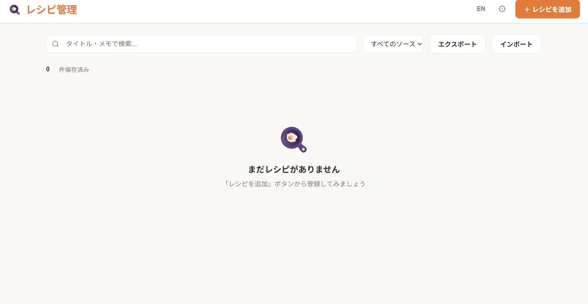
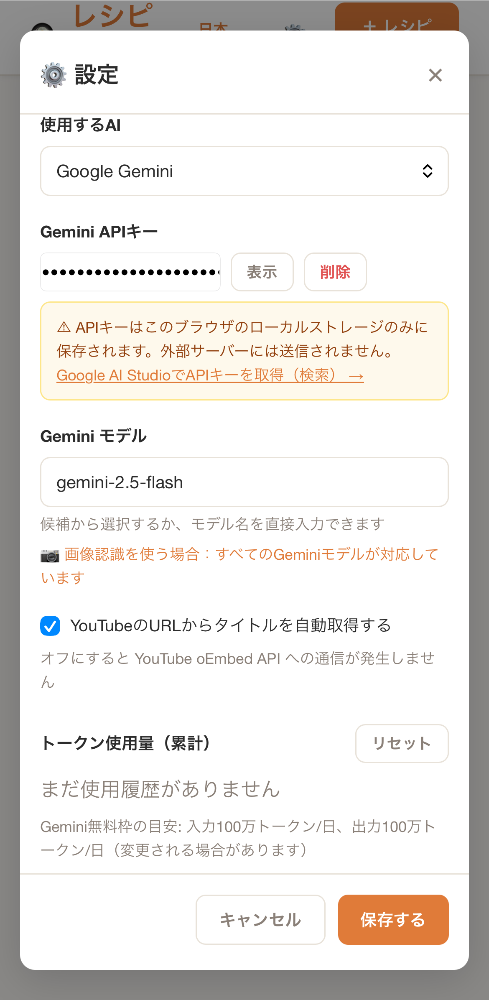

# レシピ管理アプリ 🍳

AIパース機能内蔵・ローカル完結・PWA対応のレシピ管理Webアプリ

**[🚀 今すぐ使う → https://assistantc-c.github.io/recipe-manager/recipe-manager.html](https://assistantc-c.github.io/recipe-manager/recipe-manager.html)**

---

## 特徴

- **🤖 AIレシピ自動抽出** — テキストやURLを貼るだけで、AIがタイトル・材料・手順を自動解析
- **📷 画像からも抽出** — 料理本のページ・YouTube のスクショなど、画像からもレシピを直接抽出（Gemini Vision / OpenAI Vision 対応）
- **🔗 共有から1タップ取り込み** — Android/Chrome なら共有メニューから直接追加。iOS は[ショートカット](docs/ios-share-shortcut.md)で対応
- **🔒 ローカル完結** — データはすべてブラウザ内（IndexedDB）に保存。外部サーバーへの送信なし
- **📱 PWA対応** — スマホのホーム画面に追加してアプリのように使える（iOS / Android）
- **🌐 日本語 / English** — UIの言語を切り替え可能
- **📦 JSONエクスポート** — データをJSONで持ち出せる。他のAIツールにも直接渡せる
- **💰 基本無料** — AIパース機能はGemini / ChatGPTのAPIキーを自前で用意（無料枠あり）

---

## スクリーンショット

| メイン画面 | 設定（APIキー） |
|:---:|:---:|
|  |  |

---

## 使い方

### 1. アプリを開く

[https://assistantc-c.github.io/recipe-manager/recipe-manager.html](https://assistantc-c.github.io/recipe-manager/recipe-manager.html)

ブックマーク推奨。スマホは「ホーム画面に追加」でアプリとして使えます。

### 2. レシピを追加する（手動）

「＋ レシピを追加」→ タイトル・材料・手順を入力 → 保存

### 3. AIでレシピを自動抽出（任意）

1. ⚙ 設定 → APIキーを入力して保存
2. 「＋ レシピを追加」→ **テキスト・URL・画像** のいずれかを入力
3. 「✨ AIで解析」または「📷 この画像から抽出」をクリック → タイトル・材料・手順が自動入力される

**入力方式：**

| 方式 | 用途 |
|------|------|
| テキスト貼り付け | YouTube概要欄 / レシピサイト本文 |
| URL貼り付け | YouTube動画 / レシピページ（タイトルは oEmbed で自動取得、本文は AI Parse へ手動でテキスト貼り付け） |
| **📷 画像** | **料理本のページ・スクショ・動画フレーム等から直接抽出**（Vision 対応モデル必須） |

**対応AIサービス：**

| サービス | 無料枠 | 画像認識対応モデル | 取得先 |
|---------|--------|------|--------|
| Google Gemini | あり（Gemini 2.5 Flash 等） | 全モデル | [Google AI Studio](https://aistudio.google.com/) |
| OpenAI ChatGPT | 有料（$5〜） | gpt-4o / gpt-4o-mini / gpt-4-turbo | [OpenAI Platform](https://platform.openai.com/) |

> APIキーはブラウザのLocalStorageにのみ保存されます。外部サーバーには送信されません。

### 4. 共有メニューからレシピを追加（モバイル）

YouTube アプリやブラウザの「共有」ボタンから直接レシピを追加できます。

- **Android / Chrome**：PWA をインストール後、共有メニューに「レシピ管理アプリ」が自動的に表示されます
- **iOS / Safari**：iOS は Web Share Target API に未対応のため、[ショートカットアプリで設定](docs/ios-share-shortcut.md)してください（5分・無料）

---

## データについて

| 項目 | 内容 |
|------|------|
| 保存先 | ブラウザ内 IndexedDB（容量制限なし） |
| 外部送信 | なし（AIパース使用時のみ各APIサービスへリクエスト） |
| バックアップ | エクスポート機能でJSONファイルとして保存可 |
| インポート | JSONファイルから一括取り込み可 |

---

## 技術スタック

- 単一HTMLファイル（外部フレームワークなし）
- IndexedDB（ブラウザ内データベース）
- Service Worker（PWA・オフラインキャッシュ）
- Google Gemini API / OpenAI API（任意・Structured Output対応）
- YouTube oEmbed API（URLからタイトル自動取得・任意）

---

## ライセンス

[MIT License](LICENSE)

---

[プライバシーポリシー](privacy-policy.md)
